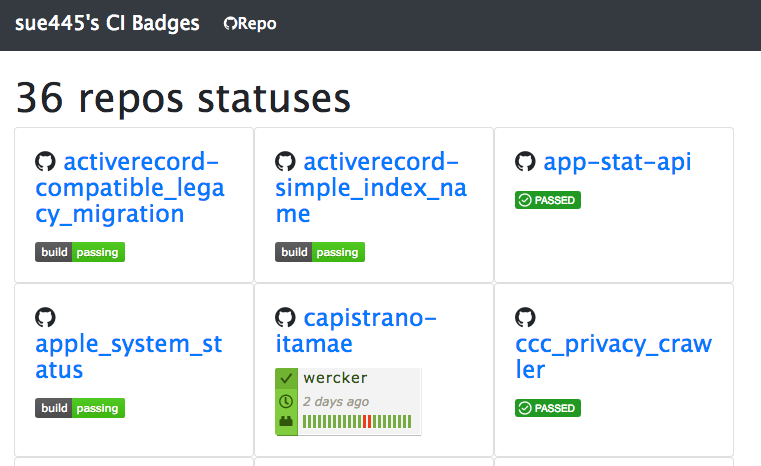

# my-ci-badges
https://sue445.github.io/my-ci-badges/



## Configuration
Edit [config/repositories.json](config/repositories.json)

Example

```json
[
  {
    "repo_url": "https://github.com/sue445/rubicure",
    "badges": [
      {
        "url": "https://travis-ci.org/sue445/rubicure",
        "img": "https://travis-ci.org/sue445/rubicure.svg?branch=master"
      }
    ]
  },
]
```